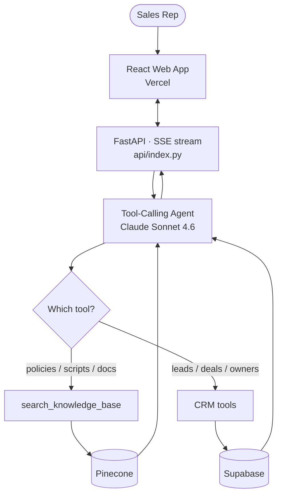

<div align="center">

# 💼 Sales Knowledge & CRM Agent

**Ask in plain English — get answers from your docs *and* your CRM, from one assistant.**

[](https://www.python.org/downloads/)
[](LICENSE)
[](https://github.com/Evan-McCall/sales-agent/stargazers)
[](https://github.com/Evan-McCall/sales-agent/commits/main)

</div>

A **RAG pipeline** for sales teams: a tool-calling agent that retrieves answers from an unstructured knowledge base (policies, scripts, product docs) *and* queries a structured CRM for live deal data — then routes each question to the right engine automatically. Reps stop hunting through PDFs and pinging managers; they just ask.

Instead of naive retrieval over everything, the LLM acts as a router. Semantic questions ("what's our refund policy?") hit a Pinecone vector store; factual questions ("who owns the Acme Corp lead?") hit Supabase. The model never reads raw data directly — it decides which tool to call and synthesizes the result. Default chat model: **Claude Sonnet 4.6**.

---

## ⚡ Quick Start

```bash
git clone https://github.com/Evan-McCall/sales-agent.git
cd sales-agent
python -m venv .venv && source .venv/bin/activate
pip install -r requirements.txt -r requirements-dev.txt   # runtime + local tooling
cp .env.example .env          # fill in your keys

# paste db/schema.sql into the Supabase SQL editor, then:
python -m db.seed
python -m ingestion.ingest_documents

# 1) API (FastAPI, serves the agent over HTTP):
uvicorn api.index:app --port 8099 --reload

# 2) Web app (in a second terminal):
cd frontend && npm install && npm run dev   # http://localhost:5173
```

Open **http://localhost:5173**, type a question, and watch the agent pick a tool and stream the answer — with its reasoning shown. The Vite dev server proxies `/api` to the FastAPI server, so it behaves exactly like the Vercel deploy.

> **Web stack:** the polished UI is a React + TypeScript app (`frontend/`, dark theme, "Stem") talking to a FastAPI endpoint (`api/index.py`) that wraps the agent and streams over SSE. The original **Streamlit** UI (`app/streamlit_app.py`) still works for quick local use — `streamlit run app/streamlit_app.py` — but is no longer the deploy target.

---

## 🚀 Deploy to Vercel

The repo is a single Vercel project: the React app builds to static files and the agent runs as a Python serverless function (`api/index.py`), wired up by `vercel.json`.

1. Push to GitHub and **Import** the repo in Vercel (or run `vercel`).
2. In **Project → Settings → Environment Variables**, add the same keys as `.env`: `ANTHROPIC_API_KEY`, `OPENAI_API_KEY`, `PINECONE_API_KEY`, `PINECONE_INDEX`, `SUPABASE_URL`, `SUPABASE_KEY` (plus any model/region overrides).
3. Deploy. Vercel builds `frontend/` and routes `/api/*` to the function.

The function installs the slim `api/requirements.txt` (no Streamlit/ingestion/test deps) to stay under Vercel's size limit. Heavy LangChain deps mean the first request after idle can cold-start for a few seconds; it's warm thereafter.

---

## 📑 Table of Contents

- [Features](#-features)
- [How It Works](#-how-it-works)
- [Installation](#-installation)
- [Usage](#-usage)
- [Project Layout](#-project-layout)
- [Example Questions](#-example-questions)
- [Roadmap](#-roadmap)
- [Contributing](#-contributing)
- [License](#-license)

---

## ✨ Features

- **Dual-engine RAG** — semantic retrieval over docs *and* exact lookups over CRM data, in one agent
- **Automatic routing** — the LLM chooses the right tool per question; no manual mode-switching
- **Knowledge base** — PDFs and text chunked, embedded, and searched via Pinecone
- **Live CRM tools** — `get_lead_status`, `get_deal_size`, `get_leads_by_rep` over Supabase (Postgres)
- **Safe by design** — predefined CRM functions, not LLM-generated SQL; no write access exposed
- **Transparent reasoning** — the UI shows which engine ran (knowledge base vs CRM), with what input, and what it returned
- **Polished web app** — a React + TypeScript frontend (dark, prompt-first) that streams answers token-by-token over SSE, deployable to Vercel
- **Model-swappable** — Claude Sonnet 4.6 by default, OpenAI via a one-line `.env` change
- **Idempotent ingestion** — deterministic chunk IDs so re-runs overwrite instead of duplicate
- **Seeded demo data** — 10 accounts, 10 leads, 8 opportunities, and 3 sample docs out of the box

---

## 🧠 How It Works

A question flows through four stages:

1. **Route** — the agent (Claude Sonnet 4.6) reads the question and decides which tool(s) to call
2. **Retrieve** — the knowledge-base tool embeds the query and pulls the top-`k` chunks from Pinecone; the CRM tools run parameterized Supabase queries
3. **Ground** — tool results are returned as text the model must answer from (it's told never to invent CRM or policy data)
4. **Synthesize** — the agent writes a concise answer, citing the source document for knowledge-base hits



> **On embeddings:** Anthropic has no embeddings endpoint, so the knowledge-base half uses **OpenAI `text-embedding-3-small`** for both ingestion and query embeddings. You therefore need an OpenAI key for embeddings even when running Claude as the chat model. The CRM half uses no embeddings.

---

## 📦 Installation

### Requirements

- **Python** 3.10 or newer
- API keys: **Anthropic** (chat), **OpenAI** (embeddings), **Pinecone**, **Supabase**

### From source

```bash
git clone https://github.com/Evan-McCall/sales-agent.git
cd sales-agent

python -m venv .venv
source .venv/bin/activate        # Windows: .venv\Scripts\activate

pip install -r requirements.txt
cp .env.example .env             # then fill in your keys
```

### Dependencies

| Package             | Purpose                                          |
| ------------------- | ------------------------------------------------ |
| `langchain`         | Agent orchestration and tool calling             |
| `langchain-anthropic` | Claude Sonnet 4.6 chat model                   |
| `langchain-openai`  | Embeddings (and optional OpenAI chat)            |
| `langchain-pinecone` | Vector store retriever                          |
| `pinecone`          | Vector database for the knowledge base           |
| `supabase`          | CRM data store (Postgres)                         |
| `pypdf`             | PDF loading for ingestion                        |
| `fastapi`           | HTTP API that streams the agent (SSE)            |
| React + Vite + Tailwind | Web frontend (`frontend/`), deployed on Vercel |
| `streamlit`         | Legacy local chat UI (dev only)                  |

---

## 🎮 Usage

Run the three stages in order (one-time setup, then launch):

```bash
# 1. Database — paste db/schema.sql into the Supabase SQL editor, then seed:
python -m db.seed

# 2. Knowledge base — chunk, embed, and upsert the sample docs (auto-creates the index):
python -m ingestion.ingest_documents

# 3. App:
streamlit run app/streamlit_app.py
```

Drop your own `.pdf` or `.txt` files into `data/documents/` and re-run step 2 to extend the knowledge base.

### Tests

```bash
pytest                      # offline smoke tests (no keys needed)
RUN_INTEGRATION=1 pytest    # also hits live Supabase + Pinecone (must be seeded/ingested)
```

---

## 🗂️ Project Layout

```
config/      settings (pydantic, reads .env)
agent/
├── llm.py            # chat + embedding factories (Claude Sonnet 4.6 default)
├── core.py           # tool-calling agent assembly + stream_agent() generator
└── tools/
    ├── knowledge_base.py   # Tool 1: Pinecone semantic search
    └── crm.py              # Tool 2: Supabase CRM functions
api/         index.py — FastAPI app: /api/health + /api/chat (SSE); requirements.txt (slim deploy deps)
frontend/    React + TS + Tailwind web app (Vite). src/components/, the SSE client in src/lib/api.ts
vercel.json  one project: builds frontend/ → static, routes /api/* to the Python function
ingestion/   ingest_documents.py — PDF/TXT → chunk → embed → Pinecone
db/          schema.sql + seed.py (stubbed CRM data)
app/         streamlit_app.py (legacy local chat UI)
data/documents/  sample policy/script/pricing docs (PDF; .txt also supported)
tests/       offline smoke tests + opt-in integration tests
```

The retrieval layer (`tools/`), data layer (`db/`, `ingestion/`), and UI (`app/`) are decoupled, so you can import the agent on its own or swap the front end.

---

## 💬 Example Questions

**Knowledge base (unstructured):**

`What is our refund policy?` · `How should I open a cold call?` · `What discount can I give without approval?`

**CRM (structured):**

`Who owns the Acme Corp lead?` · `What's the deal size for Acme Corp?` · `What leads does Jane Smith own?`

Company names match case-insensitively with fuzzy substring fallback, so `Acme` resolves to `Acme Corp`.

---

## 🛣️ Roadmap

Ideas worth exploring (no promises, no timelines):

- [ ] Automated ingestion (Airbyte / connectors) beyond a local folder
- [ ] Real Salesforce / HubSpot integration in place of stubbed Supabase data
- [x] Conversation memory across turns (in-session; the web app sends full history)
- [ ] Persistent, cross-session conversation history (currently in-memory only)
- [ ] Authentication for the web app (currently open behind the URL)
- [ ] Optional Text-to-SQL tool for ad-hoc CRM analytics
- [ ] Source-citation links back to the original document
- [ ] Eval harness for routing accuracy

Have an idea? Open an issue.

---

## 🤝 Contributing

Contributions are welcome and the bar is low.

1. **Fork** the repo
2. **Branch** from `main`
3. **Change** the thing
4. **Open a pull request** with a short description of what and why

### Adding a new CRM tool

Write a `@tool`-decorated function in `agent/tools/crm.py`, add it to `CRM_TOOLS`, and give it a clear docstring — the agent uses the docstring to decide when to call it.

---

## 📜 License

Released under the [MIT License](LICENSE). Do what you like with it.

© 2026 [Evan McCall](https://github.com/Evan-McCall)

---

<div align="center">

Built with `langchain`, `pinecone`, `supabase`, and Claude Sonnet 4.6.<br>
If this saved your team some time, please ⭐ the repo.

</div>
