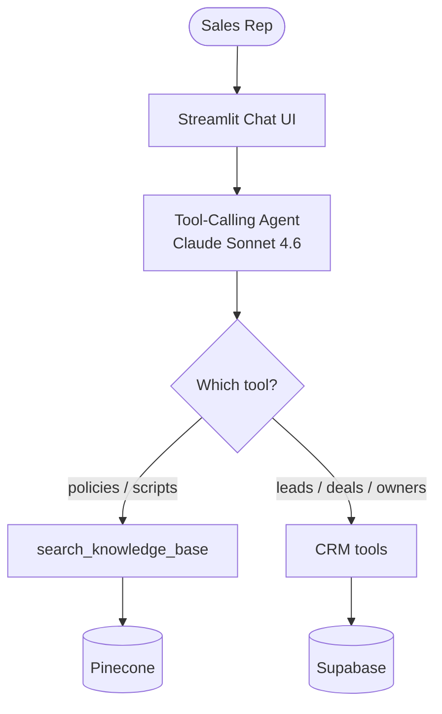

# Sales Knowledge & CRM Agent (MVP)

A unified AI agent that lets sales reps ask questions in natural language and routes each
query to the right engine:

- **Knowledge base** (unstructured) — policies, sales scripts, product docs → Pinecone semantic search.
- **CRM** (structured) — live lead/account/deal data → Supabase (Postgres).

The LLM never reads raw data directly; it's a **tool-calling agent** that decides which
engine to use. Default chat model: **Claude Sonnet 4.6**.



## Architecture note: embeddings

Anthropic has no embeddings endpoint, so the knowledge-base half uses **OpenAI
`text-embedding-3-small`** for both ingestion and query embeddings. You therefore need an
**OpenAI key for embeddings even when running Claude as the chat model**. The CRM half
uses no embeddings.

## Project layout

```
config/      settings (pydantic, reads .env)
agent/       llm factory, tools/ (knowledge_base, crm), core agent assembly
ingestion/   PDF/TXT -> chunk -> embed -> Pinecone
db/          schema.sql + seed.py (stubbed CRM data)
app/         streamlit_app.py (chat UI with tool-trace expander)
data/documents/  sample policy/script/pricing docs (PDF; .txt also supported)
tests/       offline smoke tests + opt-in integration tests
```

## Setup

```bash
python -m venv .venv && source .venv/bin/activate
pip install -r requirements.txt
cp .env.example .env          # then fill in your keys
```

Keys needed in `.env`: `ANTHROPIC_API_KEY` (chat), `OPENAI_API_KEY` (embeddings),
`PINECONE_API_KEY`, `SUPABASE_URL`, `SUPABASE_KEY`.

## Run order

1. **Database** — paste `db/schema.sql` into the Supabase SQL editor, then seed:
   ```bash
   python -m db.seed
   ```
2. **Knowledge base** — ingest the sample docs (auto-creates the Pinecone index):
   ```bash
   python -m ingestion.ingest_documents
   ```
3. **App**:
   ```bash
   streamlit run app/streamlit_app.py
   ```

## Tests

```bash
pip install -r requirements-dev.txt
pytest                      # offline smoke tests
RUN_INTEGRATION=1 pytest    # also hits live Supabase + Pinecone (must be seeded/ingested)
```

## Try asking

- What is our refund policy?
- Who owns the Acme Corp lead?
- What's the deal size for Acme Corp?
- What leads does Jane Smith own?
- How should I open a cold call?
- What discount can I give without approval?
